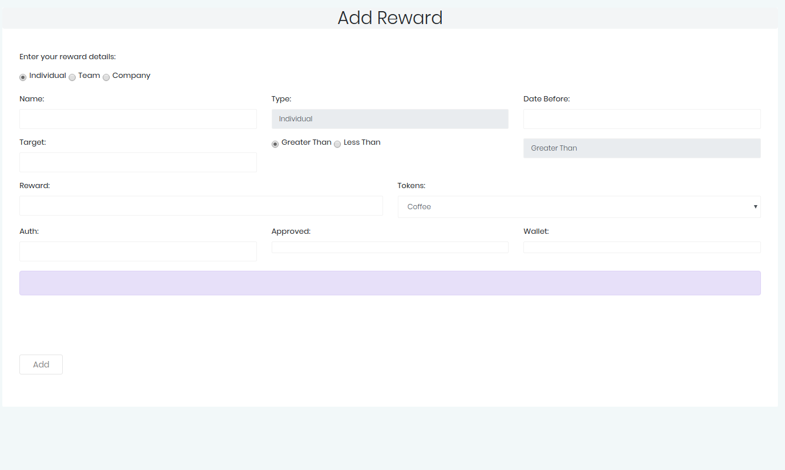

Add Reward
==========

Rewards work a similar way to bonuses. The condition for the reward is named, and then stored with its conditions. The data fields
are show below for rewards.

* Reward Type (Team, Individual, Company)
* Reward Name (unique and descriptive)
* Reward Date (this is expiry date of the Reward Condition)
* Target (the measurement which should be reached, eg hours worked)
* Condition (greater then, or less than)
* Reward Payable (what is paid)
* Token (currency of the payment)

An Auth Key is specified which is used to approve the transaction.

