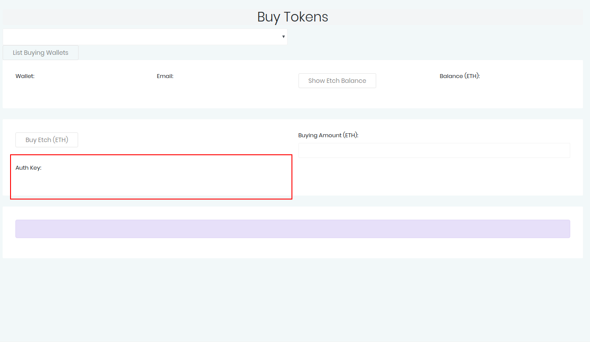

Buying Credits
==============

Etch works by the customer buying credits which are assigned to their account. This is done via the Buy Tokens screen. This screen
returns an Auth Key which is used through the system to approve transactions.

The balance on the customer account can also be seen on this screen.

